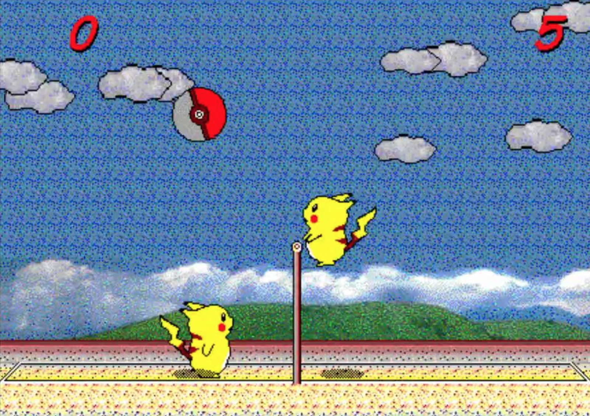

# vol game

## Name Class No.

## 專題題目: 排球小遊戲

## 小組成員:
 * 機械3A     0414040   楊燿銘
 * 機械2D     0572045   簡榮皓
 * 資管3A     0424049   許可証
 * 應日3A     0432003   吳柏賢
 * 機械4C     0514302   朱志林
 
 ## 簡介:
 * 根據小遊戲<皮卡丘打排球>進行設計
 * 將原本的皮卡丘改為機器人
 * 並利用日文音效，再將背景更改成數據
 * 以達到與科系結合目的
 * 基本操作 向左<  向右>  跳躍↑
 
 
 ## 程式 :
* 【function dragPaddle(e)  if(e.phase == "began") then--板子的初始位置 
*  lastX = e.x - paddle.x--板子只有左右移動,只改變 x 值 
* elseif(e.phase == "moved") then--板子移動中的位置 
*  paddle.x = e.x – lastX end end  --角色操作 
 
* 應日 3A 0432003 吳柏賢 】
*
* 【local background = display.newImage( "back.jpg")
* background.x = display.contentCenterX
* background.y = display.contentCenterY  --背景       
*
* local background2 = display.newImage( "pole.jpg") 
* background2.x = display.contentCenterX
* background2.y = display.contentCenterY -50 --中間分界桿    
*
* local ball = display.newImage( "pole.jpg") 
* ball.x = display.contentCenterX -200 
* ball.y = display.contentCenterY +100 --球的圖片     
*
* local backgroundMusic = audio.loadStream( "JP.mp3" ) 
* audio.play(backgroundMusic ,{ channel=1, loops=-1 })   
* audio.setVolume( 0.8 , {channel=1})  --背景音樂 0.8代表音量
    
* local ground1 = display.newImage( "ground1.jpg")
* ground1.x = display.contentCenterX-250 
* ground1.y = display.contentCenterY -100 --左方地板    
*
* local ground2 = display.newImage( "ground2.jpg") 
* ground2.x = display.contentCenterX+250
* ground2.y = display.contentCenterY -100 --右方地板    
 * 
* if event.other.type == "ball" == "ground1" then
* Total1 = Total1 + 1 ScoreText1 = Total1 
* if event.other.type == "ball" == "ground2" then 
* Total2 = Total2 + 1 ScoreText2 = Total2
* Elseif Total1 = 10 or Total2=10 then
* gameState ="Gameover" restartGame(gameState) end end -----計分 
* 機械 3A 0414040 楊燿銘 】
# [預計背景音樂] (https://www.youtube.com/watch?v=owC66LIBObg)
 
# [第一科大](http://www.nkfust.edu.tw/bin/home.php)

